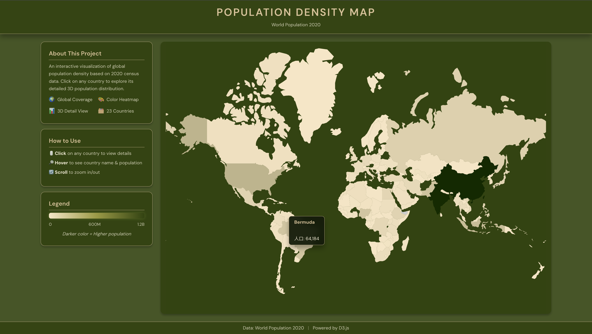
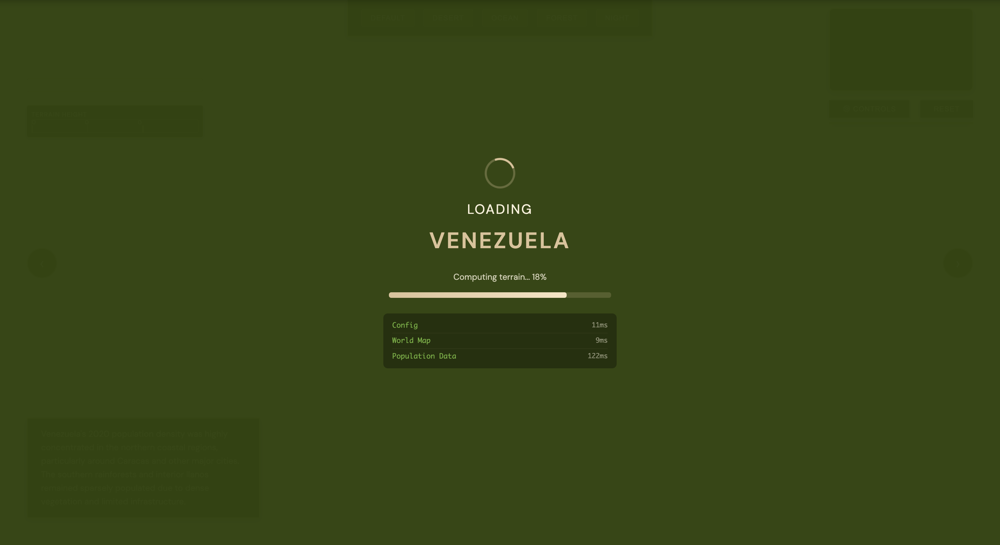
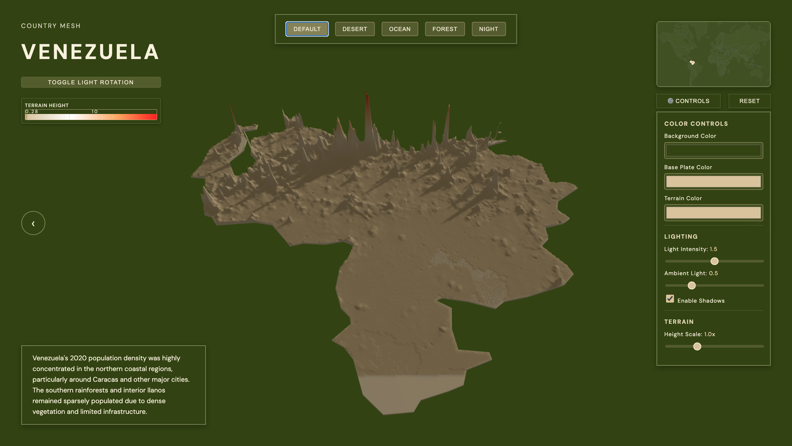

# PopulationMesh 🌍

> Interactive 3D Population Density Visualization

## About

An interactive visualization of global population density based on 2020 census data. Click on any country to explore its detailed 3D population distribution.

## Credits

### Primary Code Implementation
**221308137-沈健煌** - Main developer

### Guidance
**林捷** - Project mentor and advisor

---

## Features

- 🌍 Global Coverage - Interactive world map
- 🎨 Color Heatmap - Population density visualization
- 📊 3D Detail View - Detailed country-level population distribution
- 🗂️ 23 Countries - Comprehensive dataset

## Screenshots

### World Map (index.html)


### Country Selection


### 3D Population Mesh (country.html)


## Tech Stack

- D3.js - Data visualization
- Three.js - 3D rendering
- Vanilla JavaScript

## Data Structure

> **Note:** The `data/` folder is ignored by Git (see `.gitignore`). You'll need to add your own data files.

```
data/
├── world.json                    # World map GeoJSON data
├── world_population.csv          # Global population data
├── countries-config.json         # Country configuration
├── aus_pd_2020_1km.tif           # Australia population raster (1km resolution)
├── aus_pd_2020_1km_ASCII_XYZ.csv # Australia population point data
├── geo_info/                     # Country boundary GeoJSON (23 countries)
│   ├── CHN_geo_info.json
│   ├── USA_geo_info.json
│   ├── IND_geo_info.json
│   └── ...
└── populationData/               # Population density data (23 countries)
    ├── CHN_population_data.json
    ├── USA_population_data.json
    ├── IND_population_data.json
    └── ...
```

## Usage

Open `index.html` in a browser to view the world map. Click on any country to explore its 3D population mesh.
